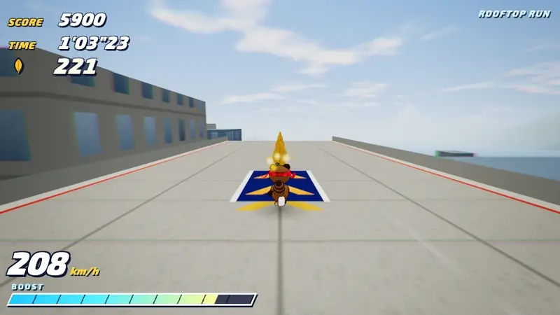
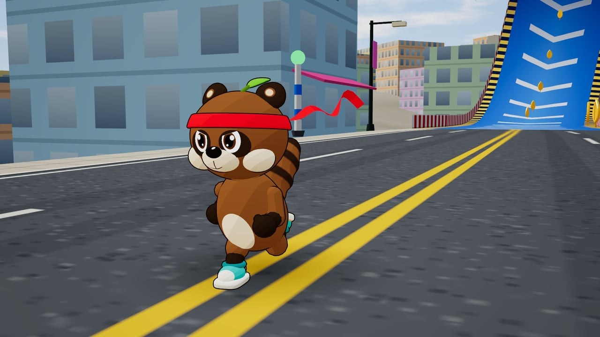
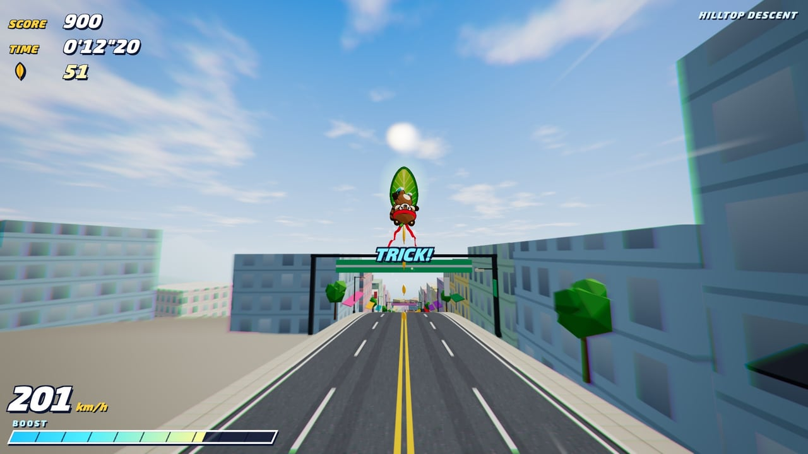
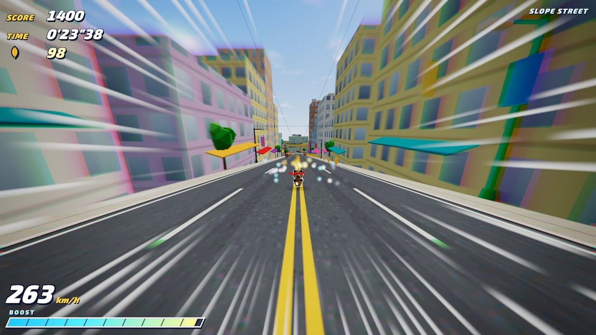
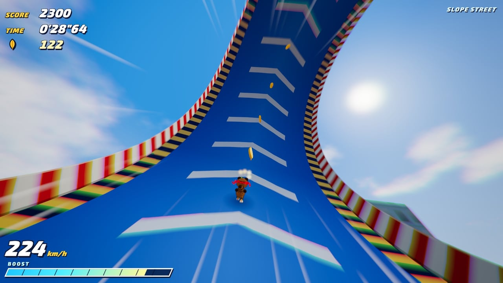
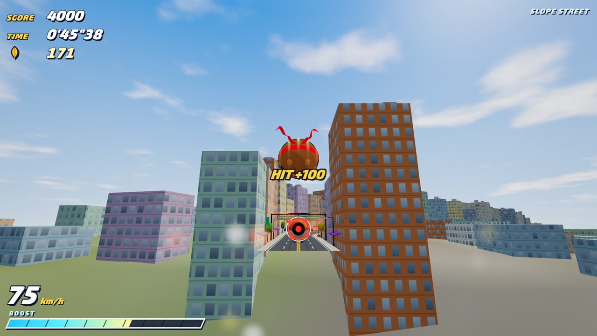
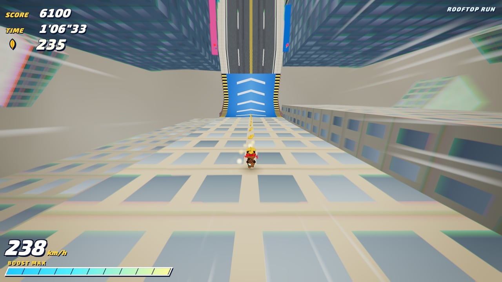
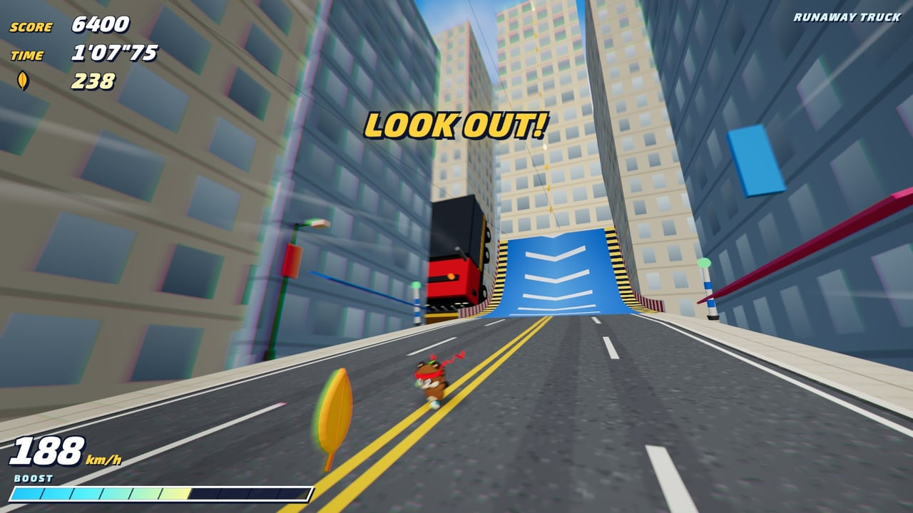
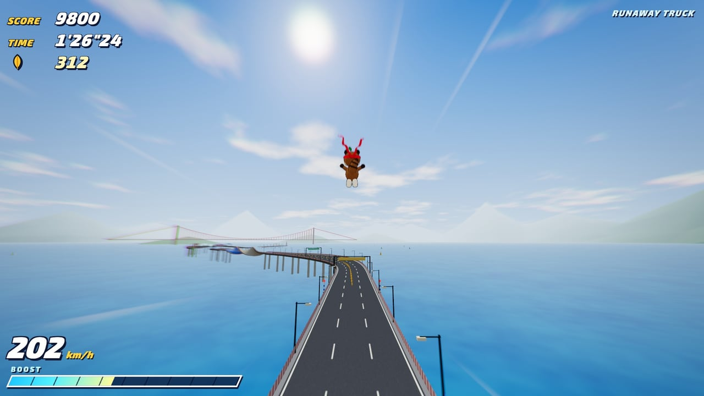

# TANUKI RUSH 🍃

坂の街を駆け下りる、ブラウザで遊べる 3D ハイスピードアクション。

[](https://tanuu5.github.io/tanuki-rush/)
[](https://www.anthropic.com/claude)
[](./LICENSE)

<p align="center">
  
</p>

<p align="center"><b><a href="https://tanuu5.github.io/tanuki-rush/">▶ ブラウザで今すぐ遊ぶ</a></b>（PC・スマホ対応、インストール不要）</p>

2000 年代初頭の 3D ハイスピードアクションへのオマージュとして作った、完全オリジナルの小さなゲームです。

主人公は、魔法の葉っぱをボードにして坂道を滑り降り、ハチマキをなびかせて街を走り抜けるタヌキ。
ループ、ビル壁面の駆け上がり・駆け下り、電線グラインド、ホーミングアタックの連鎖、そして背後から迫る暴走トラック――
丘の上から湾岸のゴールまで、約 5.7 km・2 分弱のコースを一気に駆け抜けます。

## スクリーンショット

<table>
  <tr>
    <td width="50%"><br><sub>主人公は、赤いハチマキに頭の葉っぱがトレードマークのタヌキ。</sub></td>
    <td width="50%"><br><sub>序盤は葉っぱボードで急坂を滑降。ジャンプ台ではトリック！</sub></td>
  </tr>
  <tr>
    <td><br><sub>ブーストで時速 260 km 超え。集中線と放射ブラーで一気に加速。</sub></td>
    <td><br><sub>ダッシュパネルで勢いをつけて、ループを駆け抜ける。</sub></td>
  </tr>
  <tr>
    <td><br><sub>空中で敵をロックオン。ホーミングの連鎖で谷を越える。</sub></td>
    <td><br><sub>屋上を跳び移ったら、ビルの壁面を垂直に駆け下りる。</sub></td>
  </tr>
  <tr>
    <td><br><sub>背後から暴走トラック！　登場の瞬間はスローモーションで振り返る。</sub></td>
    <td><br><sub>運河を飛び越えて、つり橋の見える湾岸ハイウェイへ。</sub></td>
  </tr>
</table>

画像と動画は、すべて実際のゲーム画面です。

## 遊び方

走りは自動です。左右の移動・ジャンプ・ブーストで、リーフを集めながらゴールを目指します。

| 操作 | キーボード | ゲームパッド | タッチ |
| --- | --- | --- | --- |
| 左右に移動 | ← → / A D | 左スティック / 十字キー | 画面左側をドラッグ |
| ジャンプ | Space / J / Z | A | JUMP |
| ホーミングアタック | 空中でもう一度ジャンプ | 空中で A | 空中で JUMP |
| ブースト | Shift / K / X | X / B / RT | BOOST |
| ブレーキ | ↓ / S | LT | BRAKE |
| トリック | ジャンプ台で飛んだ後に ↑↓←→ | 十字キー | — |
| ポーズ | Esc / P | Start | II |

- **リーフ**：集めるとブーストゲージが溜まります。ダメージを受けると散らばり、0 枚で当たるとミス。
- **ブースト**：ゲージを使って一気に加速。ブースト中は敵や駐車中の車を吹き飛ばせます。
- **ホーミングアタック**：空中で敵をロックオン（赤いマーク）したらもう一度ジャンプ。連続で決めると CHAIN ボーナス。
- ゴールでタイム・スコアから S〜D のランクが付きます（ベスト記録はブラウザに保存）。
- タイトル画面で画質（低／中／高）、音の ON/OFF、「演出ひかえめ」（ブラー・集中線・画面揺れを弱める）を切り替えられます。

## 制作について

このゲームは、Anthropic の **Claude Opus 5.5**（推論エフォート：**MAX**）で作りました。

Claude Code 上で、プログラムはもちろん、コースのレイアウト、3D モデル（タヌキ・街並み・トラック）、テクスチャ、BGM・効果音まで、すべて Claude がコードとして生成しています。画像や音声の素材ファイルは一切使っていません。

- 企画・テストプレイ：たぬ
- 制作：Claude Opus 5.5（MAX）

## 開発

```bash
npm install
npm run dev      # http://127.0.0.1:5173
npm run build    # dist/ に出力
npm run preview  # ビルド結果の確認
```

スマホで試すときは `npm run dev -- --host 0.0.0.0` で同じ LAN から開けます（横向きがおすすめ）。

デバッグ用の URL パラメータ：

| パラメータ | 内容 |
| --- | --- |
| `?q=low` / `mid` / `high` | 画質（タイトル画面でも変更可） |
| `?s=2300` | コース上の距離 2300 m から開始 |
| `?bot` | 自動操縦でプレイ（動作確認用） |

## GitHub Pages で公開する

1. このフォルダを GitHub リポジトリとして push します（ブランチ `main`）。
2. リポジトリの **Settings → Pages → Build and deployment → Source** を **GitHub Actions** にします。
3. `main` に push するたびに `.github/workflows/deploy.yml` がビルドして公開します。

`vite.config.js` の `base: './'` により、`https://<ユーザー名>.github.io/<リポジトリ名>/` のようなサブパスでもそのまま動きます。

## 構成

```
src/
  Game.js            ゲーム全体（状態遷移・イベント・演出）
  track/             コースのスプライン生成（タートル方式）とメッシュ化
  level/             コース定義・地形・街並み・空・海・遠景
  player/            タヌキの物理挙動とモデル
  camera/            コースに沿って走るチェイスカメラ
  objects/           リーフ・敵・ジャンプ台・車・トラックなど
  fx/                パーティクル、ポストエフェクト（放射ブラー・集中線・色収差）
  audio/             Web Audio による BGM・効果音の生成
  ui/                HUD・タイトル・リザルト・タッチ操作
docs/images/         README 用のスクリーンショットとプレイ映像
```

## ライセンス

[MIT License](./LICENSE) © 2026 たぬ

- [three.js](https://threejs.org/)（MIT License）を使用しています。
- UI フォント（Exo 2 / M PLUS Rounded 1c）は Google Fonts から読み込んでいます（SIL Open Font License）。
